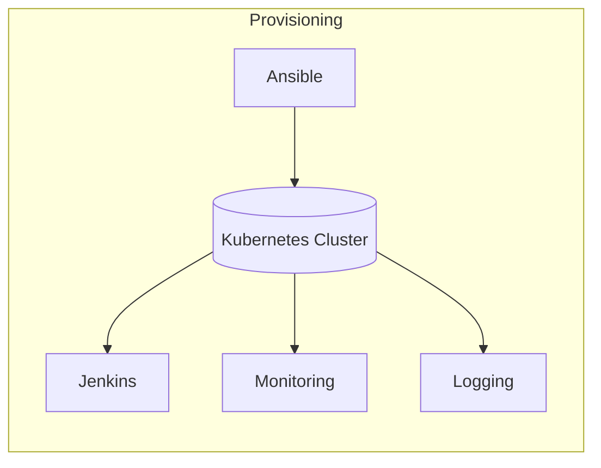
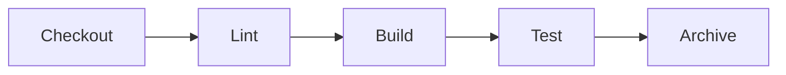
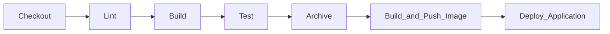

This repository hosts a diploma project that automates infrastructure preparation and **Kubernetes cluster** deployment. The entire workflow adheres to the **Infrastructure-as-Code** paradigm:

- a single **Ansible** command provisions all servers and initializes the Kubernetes cluster;
- a separate playbook deploys **Jenkins** together with the monitoring and centralized logging stack.
  
Once the environment is ready, Jenkins listens for **GitHub web-hooks** and, depending on the branch, either runs a verification scenario or performs a production rollout of the application.

The project is **idempotent**: rerunning the playbooks or manifests does not introduce unwanted changes and does not break the already-deployed infrastructure. 
Thanks to parameterized variables, the solution is easily **reusable**—just adjust the variable values to adapt the stack to another environment or domain names.

### Toolchain

- **Ansible** — Infrastructure provisioning and configuration
- **Jenkins** — CI/CD pipeline triggered by GitHub web-hook
- **Prometheus + Grafana + Alertmanager + Node Exporter** — Cluster and application monitoring
- **ELK** (Elasticsearch + Logstash + Filebeat + Kibana) — Centralized logging
  
The CI/CD pipeline lints the code, builds, tests, stores the JAR artifact, and publishes a Docker image to Docker Hub. For the main branch it also performs an automatic deployment to the cluster.

---

## Table of Contents

1. [High‑Level Architecture](#high-level-architecture)
2. [Repository Structure](#repository-structure)
3. [Quick Start](#quick-start)
4. [CI/CD Pipeline](#cicd-pipeline)
5. [Monitoring & Logging](#monitoring--logging)
6. [Security](#security)
7. [Author](#author)

---

## High-Level Architecture



- After receiving a GitHub webhook, Jenkins automatically triggers the CI/CD pipeline.
- All external traffic is routed through the **NGINX Ingress controller**, which serves as the single entry point and load balancer.
- Sensitive data is securely encrypted and stored as **SealedSecrets**; secret values are taken from **secrets.env.example**
---

## Repository Structure

```text
Diplom_DOS25/
├─ Ansible/                    # Ansible roles for server prep, cluster bootstrap, and deploying Jenkins, monitoring, and logging stacks into Kubernetes
├─ k8s-manifests/              # Kubernetes resources managed via Kustomize
│  ├─ app/                     # Deployment and Service for Spring PetClinic
│  ├─ monitoring/              # Prometheus, Grafana, Alertmanager, Node Exporter
│  ├─ logging/                 # Elasticsearch, Logstash, Kibana, Filebeat
│  ├─ jenkins/                 # Jenkins, JCasC configuration, Ingress
│  ├─ metallb/                 # MetalLB address pool and L4 load-balancer configuration
│  ├─ storage/                 # PersistentVolume and StorageClass definitions for durable data
│  └─ ingress-nginx/           # Helm-rendered manifests for the NGINX Ingress controller
├─ app/                        # Spring PetClinic source code and Maven Wrapper
├─ Jenkinsfile                 # Jenkins CI/CD pipeline definition
├─ install_Ansible_and_k8s.sh  # Installs Ansible and runs the playbook to prepare servers and bootstrap the cluster
└─ secrets.env.example         # Template with environment variables for secrets (to be filled by the user)
```

## Quick Start

```bash
# 1 · Clone the repository
$ git clone https://github.com/kirillank/Diplom_DOS25.git
$ cd Diplom_DOS25

# 2 · Populate secrets.env.example with your own values
$ vi secrets.env.example

# 3.1 · If you still need to install Ansible, set up Kubernetes, and bootstrap the cluster, run:
$ ./install_Ansible_and_k8s.sh

# 3.2 · If the Kubernetes cluster is already up, deploy Jenkins, monitoring, and logging with:
$ ansible-playbook Ansible/deploy.yml
```

After the setup completes:

- **Jenkins** is available at http://jenkins.local and waits for an incoming webhook to trigger the pipeline.
- **Grafana** is available at http://grafana.local with a configured data source and ready-made dashboards for nodes and the application.
- **Prometheus** is available at http://prometheus.local with alert rules enabled.
- **Kibana** is available at http://kibana.local.

All these hostnames are defined by the corresponding Ingress rules.

---

## CI/CD Pipeline

| Service | URL (Ingress)            | Credentials*                         | Notes                         |
| ------- | ------------------------ | ------------------------------------ | ----------------------------- |
| Jenkins | `http://jenkins.local`   | `JENKINS_ADMIN_ID` / `JENKINS_ADMIN_PASSWORD` | Waits for GitHub webhook      |

\* Variables are specified in secrets.env.example and encrypted as SealedSecrets.

The pipeline has two execution paths:

| Path           | Condition           | Steps                                                                                                               |
| -------------- | ------------------- | ------------------------------------------------------------------------------------------------------------------- |
| **Feature**    | any branch ≠ `main` | `Checkout → Lint → Build → Test → Archive → Build & Push Image`                                                                          |
| **Production** | push to `main`      | all feature steps **plus** `Deploy Application` |

The pipeline is triggered by a **GitHub webhook** on every push.

#### 1. Feature-branch pipeline (any branch except `main`)

#### 2. Main-branch pipeline

\* After a successful pipeline run, the application becomes available at http://petclinic.example.com.

---

## Monitoring & Logging

| Service        | URL (Ingress)            | Credentials*                  | Notes                                              |
| -------------- | ------------------------ | ----------------------------- | -------------------------------------------------- |
| Prometheus     | `http://prometheus.local`| —                             | node-exporter & app metrics                        |
| Grafana        | `http://grafana.local`   | `GRAFANA_USERNAME` / `GRAFANA_PASSWORD` | Dashboards loaded from ConfigMap                   |
| Alertmanager   | —                        | —                             | Telegram bot notifications                             |
| Elasticsearch  | —                        | —             | Log storage                                        |
| Kibana         | `http://kibana.local`    | `admin` / `admin123`              | Log visualisation                                  |

\* Variables are also defined in secrets.env.example and encrypted as SealedSecrets.

---

## Security

- Secrets stored solely as **SealedSecrets**.
- Ingress resources can be protected with TLS certificates (cert‑manager + Let’s Encrypt).
- Strict RBAC — dedicated ServiceAccounts per service.

---


## Author

**Kiryl Ankudzinau** — student at *TeachMeSkills*, course “DevOps Engineer”, group **DOS25‑onl**. Feel free to open issues/PRs or contact via Telegram **@argoetstol**.
