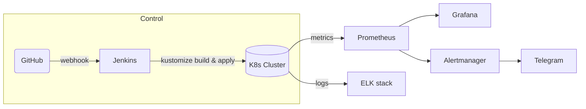
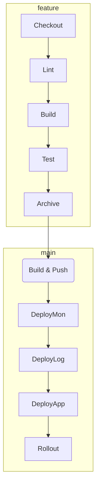

This repository contains a diploma project that **prepares the infrastructure and spins up a Kubernetes cluster pre‑configured for the Spring PetClinic application**. Everything is built around the *Infrastructure‑as‑Code* approach: a single Ansible command provisions all servers and configures the cluster. Once ready, Jenkins is triggered by a GitHub webhook; depending on the branch it runs a verification scenario or a production rollout (including monitoring and logging).

### Toolchain

- **Ansible** — provisioning & configuration
- **Jenkins** — CI/CD (pipeline triggered by GitHub webhook)
- **Telegram** — build & deploy notifications
- **Prometheus + Grafana + Alertmanager + Node Exporter** — monitoring
- **ELK** (Elasticsearch + Logstash + Filebeat + Kibana) — centralised logging

The pipeline lints the code, builds, tests and publishes the container image. For the `main` branch it also performs an automatic deployment to the cluster.

---

## Table of Contents

1. [High‑Level Architecture](#high-level-architecture)
2. [Repository Structure](#repository-structure)
3. [Environment Requirements](#environment-requirements)
4. [Quick Start](#quick-start)
5. [CI/CD Pipeline](#cicd-pipeline)
6. [Monitoring & Logging](#monitoring--logging)
7. [Security](#security)
8. [Roadmap](#roadmap)
9. [Author & License](#author--license)

---

## High‑Level Architecture



- **Jenkins** receives the GitHub webhook and automatically starts the pipeline.
- All external exposure is handled by the **NGINX Ingress controller**.
- Secrets are stored as **SealedSecrets** generated by `generate_secrets_up_jenkins.sh` from `secrets.env`.

---

## Repository Structure

```text
Diplom_DOS25/
├─ Ansible/                 # Kubernetes installation & node prep
├─ k8s-manifests/           # Kubernetes objects managed by kustomize
│  ├─ app/                  # Deployment + Service for PetClinic
│  ├─ monitoring/           # Prometheus, Grafana, Alertmanager, node‑exporter
│  ├─ logging/              # Elasticsearch, Logstash, Kibana, Filebeat
│  ├─ jenkins/              # Jenkins + JCasC + ingress
│  └─ ingress-nginx/        # Helm manifests of the ingress controller
├─ app/                     # Spring PetClinic sources + Maven Wrapper
├─ Jenkinsfile              # CI/CD pipeline definition
├─ generate_secrets_up_jenkins.sh  # bootstrap script: Ansible → SealedSecrets → apply
└─ secrets.env.example      # template to be filled by the user
```

---

## Environment Requirements

| Component           | Version          | Minimum resources\*                                 |
| ------------------- | ---------------- | --------------------------------------------------- |
| Ubuntu Server       | 24.04 LTS        | 5 VMs: 1 master + 4 workers, 2 vCPU / 4 GB RAM each |
| Ansible             | ≥ 9.x            | runs on the master node                             |
| Kubernetes          | 1.33.x           | kubeadm + Flannel                                   |
| Docker Hub          | account + PAT    | image publishing                                    |
| Telegram Bot (opt.) | token + chat\_id | Alertmanager notifications                          |

\* Suitable for demo/dev; production needs more CPU/RAM and dedicated storage.

---

## Quick Start

```bash
# 1 · Clone repository
$ git clone https://github.com/kirillank/Diplom_DOS25.git
$ cd Diplom_DOS25

# 2 · Edit secrets.env.example with your values,

$ vi secrets.env.example

# 3 · Run the bootstrap script (takes 10‑15 min on first run)
$ ./generate_secrets_up_jenkins.sh
```

After completion:

- **Jenkins** is available at `http://jenkins.local:30080` and waits for a webhook to start the pipeline.
- Grafana, Prometheus and Kibana URLs are defined by the ingress rules.

---

## CI/CD Pipeline

The pipeline has two execution paths:

| Path           | Condition           | Steps                                                                                                               |
| -------------- | ------------------- | ------------------------------------------------------------------------------------------------------------------- |
| **Feature**    | any branch ≠ `main` | `Checkout → Lint → Build → Test → Archive`                                                                          |
| **Production** | push to `main`      | all feature steps **plus** `Build & Push Image → Deploy Monitoring → Deploy Logging → Deploy Application → Rollout` |

The pipeline is triggered by a **GitHub webhook** on every push.



---

## Monitoring & Logging

| Service       | URL (Ingress)                  | Notes                                                 |
| ------------- | ------------------------------ | ----------------------------------------------------- |
| Prometheus    | `prometheus.local:30080`       | node‑exporter & app metrics                           |
| Grafana       | `grafana.local:30080`          | dashboards from `ConfigMap`; creds from `secrets.env` |
| Alertmanager  |                                | Telegram notifications                                |
| Elasticsearch |                                | log storage                                           |
| Kibana        | `kibana.local:30080`           | log visualisation                                     |

---

## Security

- Secrets stored solely as **SealedSecrets** — encrypted at rest in Git.
- Ingress resources can be protected with TLS certificates (cert‑manager + Let’s Encrypt).
- Strict RBAC — dedicated ServiceAccounts per service.

---


## Author & License

**Kiryl Ankudzinau** — student at *TeachMeSkills*, course “DevOps Engineer”, group **DOS25‑onl**. Feel free to open issues/PRs or contact via Telegram **@argoetstol**.

Code is distributed under the **MIT License**.


